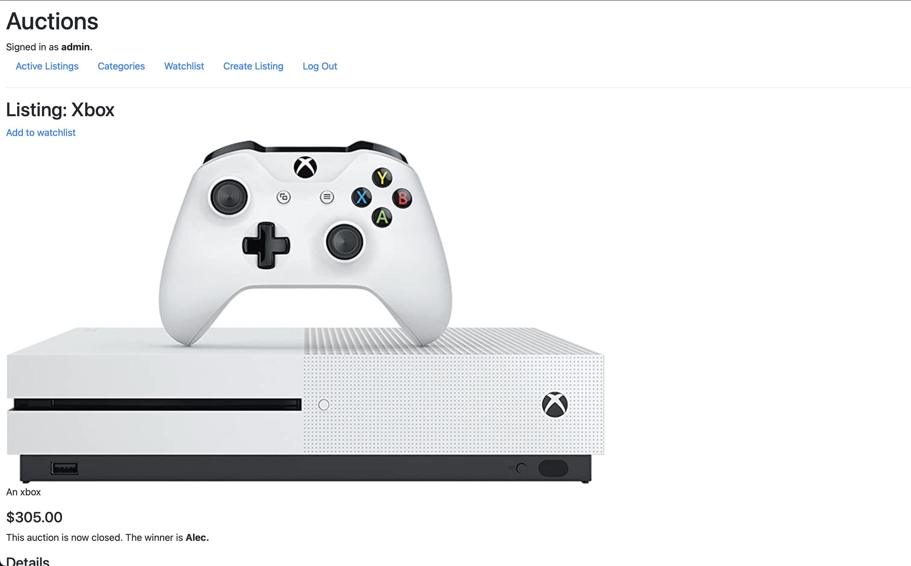

# Commerce
Web application that allows users to buy and sell items via online auction. It leverages several features of Django including Authentication, Models, Templates, and Forms.

## Use
After logging in, users can add a listing to the auctions page.

  

After their listing is created, others may view it and place bids.

  

The owner of the item may close the bidding whenever they wish to. When this is done, the highest bidder becomes the winner.

  

Each listing page contains additional details about the listing (e.g., category) as well as a comments section.

  

